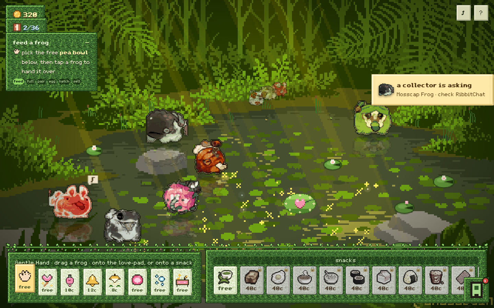
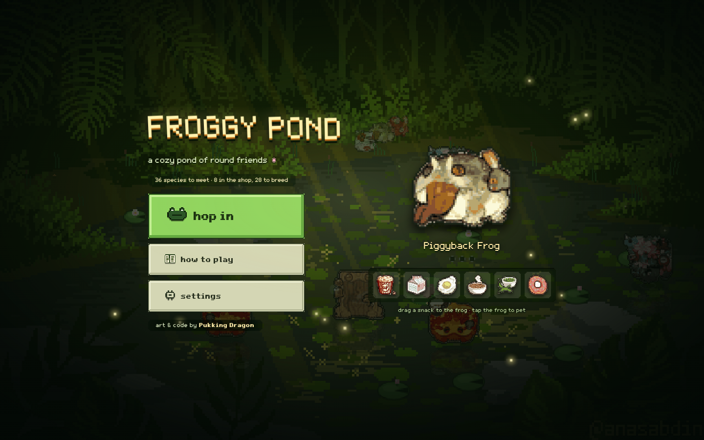
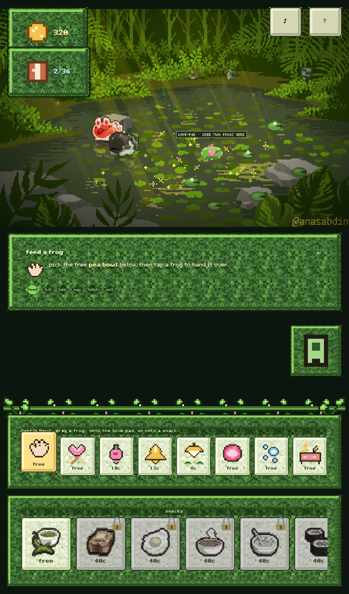
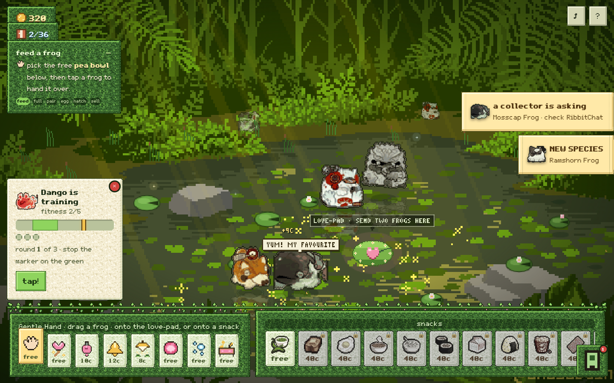
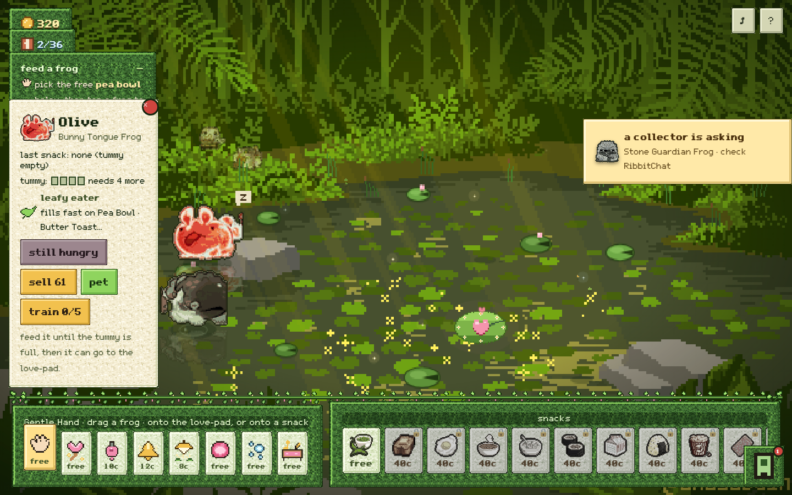
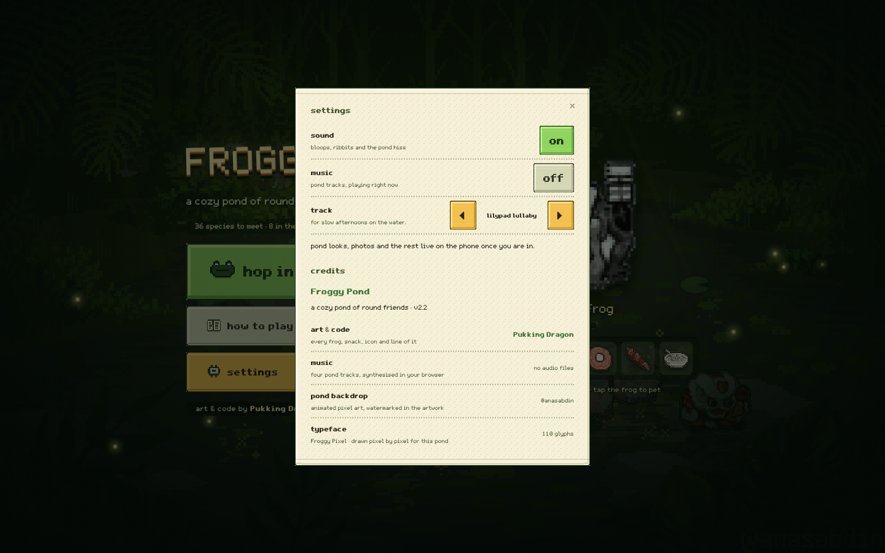
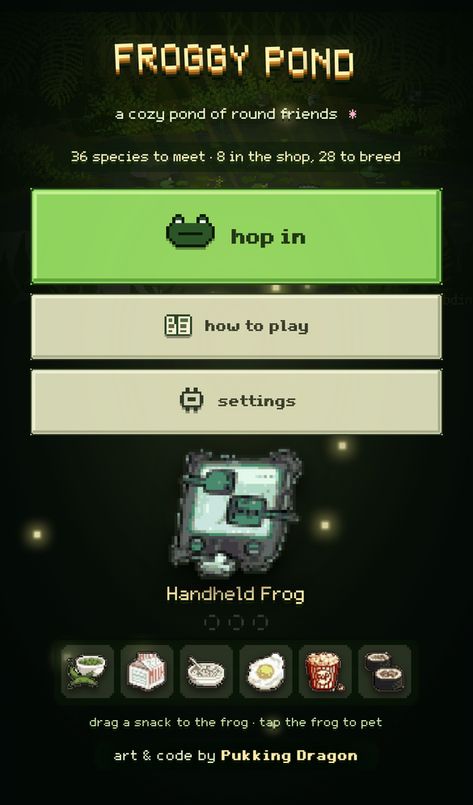
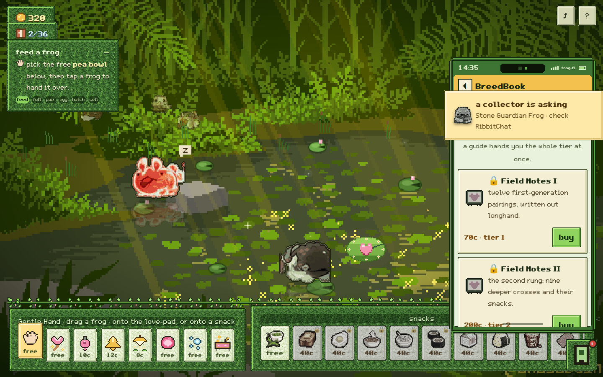
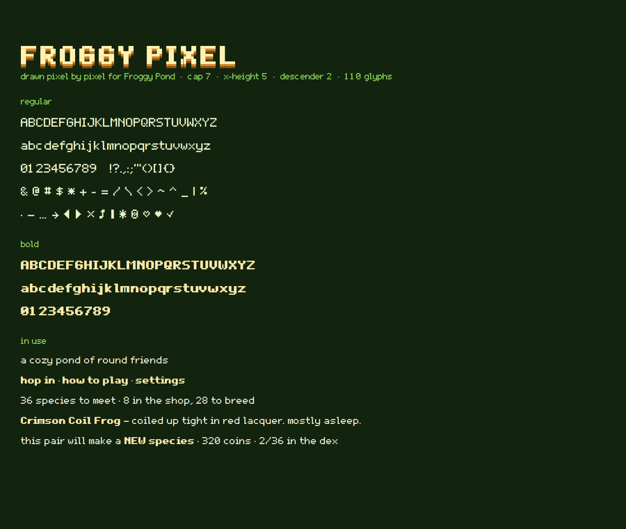
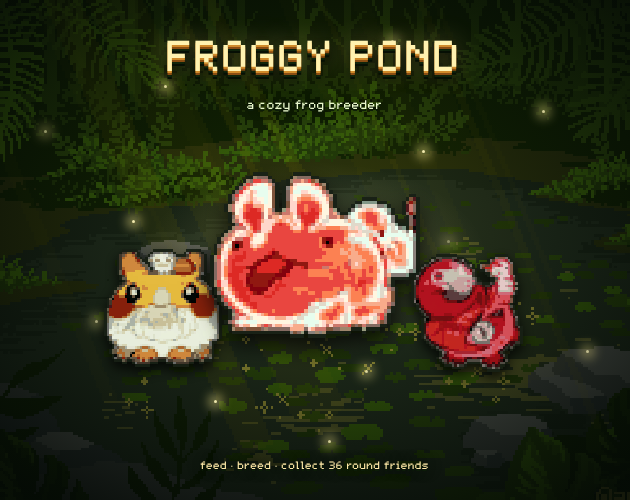

# 🐸 Froggy Pond — a cozy frog breeder simulator

A little pixel-art pond where you feed, breed, collect and sell round frogs.
36 species, 22 snacks, 8 tools, 14 phone apps, four pond tracks, one sleepy pond.

You start with one free snack — the **pea bowl** — and everything else is earned.
Every frog has its own diet, and nobody breeds on an empty stomach.





## Play

**Just open `index.html`.** Double-click it, or drag it into a browser — the
sprite art is inlined, so there is no loading screen, nothing to install and no
server needed. Serving the folder over http (`npx http-server`) only adds the
pond's animated background, which is optional.

**Works with a finger.** Everything is one pointer path, so a tap, a press and a
drag all mean the same thing whether you are on a mouse or a phone: press a frog
to pick it up, drag to carry it, let go to set it down, tap to pet it. On a
narrow screen the tool strip and snack tray stack, the pond sits up at the top
and the frog card tucks in above the bar.



Progress saves automatically in your browser.

## The loop, and how the pond teaches it



A tracker sits in the top-left corner and reads the pond, not a script: it names
**the next thing to do**, and under that runs the whole loop as six chips —
**feed → full → pair → egg → hatch → sell** — with the stage you are actually in
lit up. On a fresh pond it is the tutorial; once you have been round once it
folds down to the strip so it stops explaining and just keeps score. Tap it to
collapse or reopen it.

On a phone the pond is letterboxed, which leaves a band of nothing under it, so
that is where the tracker docks — it covers no water at all.

### One skill test: training

Everything else in the pond is patient, so there is exactly one thing you can be
good at. **Train** on a frog's card sweeps a marker across a bar three times, each
round faster with a narrower green: stop it on the green. A clean sweep is worth
**+2 fitness**, one hit **+1**, up to five. Each point takes **8% off the rest** a
frog needs after laying an egg and adds **4% to what it sells for**, and the card
shows both. The panel opens where the frog card opens, above the bar.

**Dragonflies pay.** They cross the pond every few seconds; tap one before it
leaves and it is worth 6–14 coins. It is the only thing in the pond that rewards
a fast hand.

## How it works

- **Nothing pops up in the middle.** Each kind of news gets the shape that suits
  it, instead of one note box for everything: a **nudge** appears exactly where
  you tapped when something cannot be done there; a **banner** slides in from the
  right edge for the moments worth stopping for (a new species, an egg, a frog
  grown up); frogs say things themselves in **pixel speech bubbles out in the
  water**; coins **fly off** the thing that earned or cost them; and the quiet
  **notes** stack in the top-right corner. What is in your hand is written on the
  tool rack's own label rather than on a strip across the pond.
- **Throw snacks** — pick a snack from the tray, then tap the open water.
  It arcs in, splashes, and the frogs swarm it; the closest one gets the bite.
  Every frog remembers its **last snack**.
  You can also **tap a frog** with a snack selected to hand-feed it directly —
  the reliable way to get one particular snack into one particular frog.
- **The pea bowl is the only free snack.** It sits first in the tray and never
  costs anything, and it opens two species on its own. Every other snack has to
  be unlocked in ShopHop first — the tray shows each locked slot's *unlock* price
  and runs cheapest-first, so it reads left-to-right as the ladder it is. Selling
  the frogs the peas give you is how you climb the first rung.
- **Feed a frog full before it will breed.** Every frog has a **tummy** of four
  pips, shown on its card and over its head while you're holding a snack. An empty
  frog is turned away from the love-pad; a full one is welcome. Laying an egg
  empties both parents, so a working pair needs feeding again each round.
- **Every frog has a diet** — *leafy*, *savoury* or *sweet*. Its own kind of food
  fills it **twice as fast**: two bites of a favourite, four of anything else.
  Nothing is ever refused, and the free pea bowl is leafy, so a fresh pond can
  always fill anybody — just slowly, for the frogs that would rather have cake. A
  bred frog inherits the diet of the snack it hatched from, and ShopHop tells you
  what a frog eats before you buy it.

  
- **Breed with a breeding tool.** Take the **Love Wand**, tap one frog, tap
  another, and they walk to the pink **love-pad** by themselves. (The Gentle Hand
  works too — just drop a frog on the pad. `breed` on a frog's card hands you the
  wand with that frog already chosen.) If the pair matches a recipe and **either**
  parent last ate that recipe's snack, the egg hatches a brand-new species. Any
  other pairing gives you a copy of a parent — still worth selling. Parents aren't
  consumed and keep their snack, so a working pair keeps giving. The love-pad tells
  you on screen what the current pair will make, or which snack it still wants.
- **Breeding is the slow part of the pond, on purpose.** The pair courts for a
  while (there's a pink bar under the love-pad sign), then the egg warms for a
  good while longer (a green bar under the egg fills as it goes), then the froglet
  grows up, and both parents rest before they'll pair again. The **Sun Lamp** is
  the paid way to skip any of those three waits.
- **Froglets** hatch small and grow up before they can breed or be sold.
- **Tools** — eight of them, in the strip beside the snacks.

  *Breeding:*
  - **Gentle Hand** (free) — lift a frog and set it down anywhere. Drop it on the
    love-pad to breed, or onto a snack to choose exactly who eats what. It's what
    you start holding, and a press without a drag just pets the frog.
  - **Love Wand** (free) — the quick way to breed: tap one frog, then its
    partner. No walking them over, no menus.
  - **Breed Tonic** (10c) — for two minutes that frog makes the best baby it
    can: it works with no snack at all, crosses the pond for the next snack,
    rests and hatches quicker, and never wastes a pairing. Dosed frogs shimmer.
  - **Matchmaker Bell** (12c) — ring it at a frog and it marks the best partner
    in your pond with a gold heart, and says which snack the pair still needs.
    If nothing in the pond matches, it tells you so and costs nothing.

  *Speed-up:*
  - **Sun Lamp** (8c) — the answer to every wait. Tap the egg on the love-pad and
    it hatches in well under half the time; tap a resting frog and its rest ends;
    tap a froglet and it grows up much sooner.

  *Toys:*
  - **Bouncy Ball** (free) — tap the water to bounce it. Frogs hop after it and
    headbutt it around, which gives them zoomies, trims their rest and helps
    froglets grow. Tap again anywhere to kick it that way.
  - **Bubble Wand** (free) — tap or drag across the water to blow bubbles. No
    frog can leave one alone; popping one is worth zoomies and a little growing.
  - **Music Box** (free) — set it down in the pond and it plays whatever RibbitFM
    is on, and every frog nearby gathers round and bops on the beat. Tap the box
    again to pick it up.
- **The phone** (bottom right) — a frog-themed handset with fourteen apps:
  - 🛒 **ShopHop** — buy the 8 starter frogs, and unlock snacks. Since only the
    pea bowl is free, this is where most of your coins go early on.
  - 📖 **FrogDex** — the collection. Unmet frogs are silhouettes; once you've met
    either parent of a recipe, the Dex reveals it. It remembers every frog you've
    met even after you sell it, so selling never costs you progress.
  - 📗 **BreedBook** — buy **breeding guides**. Field Notes I–III and the Legend
    Ledger (70c / 200c / 520c / 1100c) each hand you a whole tier of recipes up
    front, parents and snack spelled out, whether or not you've met anybody. Own
    one and it becomes a readable notebook: every pairing in that tier, with both
    parent portraits and the snack it wants. It also says how many of the 28
    recipes you can currently read.
  - 🥗 **SnackDex** — all 22 snacks: art, description, what a throw costs, and
    what each one breeds (subject to the same "can you read it yet" rule). Locked
    snacks can be unlocked straight from here.
  - 💬 **RibbitChat** — collectors message you wanting a specific frog and pay
    1.4–1.9× the shelf price. This is the main way to fund the fancy snacks.
  - ⚙️ **Settings** — sound, music and a pond reset.
  - 🌄 **Pondscape** — buy and apply 10 pond looks (dawn mist, blossom spring,
    autumn, rain, golden hour, moonlit, thunderhead, first snow, aurora) plus six
    little ornaments. Each look is a colour treatment of the same pond art with
    its own weather: snow, petals, rain, leaves, fireflies, stars, lightning.
  - 📷 **PondCam** — a live viewfinder of your actual pond, with a shutter that
    keeps real photos, and 🖼 **Album** to look back at them.
  - 📼 **RibbitFM** — four real pond tracks, synthesised note by note in the
    browser: *lilypad lullaby*, *puddle skip*, *moss and honey* and *rain on the
    rock*. Play, stop, skip, or pick one from the list; the sleeve doubles as a
    level meter. Whatever is on here is what the Music Box plays in the pond.
  - ⛅ **Cloudpad**, 👟 **Hopcount**, 🌙 **Frogscope** and 📓 **PondDiary** —
    a sky and weather readout, how far your frogs hopped today, a daily reading
    for one of them, and a diary the pond keeps of hatchings, sales and
    redecorating.
- **Goal** — meet all **36 species**. 8 are buyable; the other 28 are breed-only,
  four tiers deep, ending in two legendaries.

The pond holds 12 frogs at a time, which is the real pacing constraint: to go
deeper you sell frogs you've already recorded to make room.

Frogs squash and stretch on every hop, waddle between nearby spots, doze off
with a little `z`, croak, cast reflections in the water, and get the zoomies off
a matcha latte. Petting is free, and keeping at it builds a combo: more hearts,
a bigger squish, and by the fourth pet they bounce off in delight.

## The main menu

The menu sits **straight on the pond** — no panel, no sign, no lily pad. It is two
halves: the **name and three buttons on the left**, and a **frog you can feed on
the right**. Fireflies drift through the shade, the attract-mode frogs keep to the
low water so they never crowd the mascot, and every button wears its own pixel
icon — a frog for **hop in**, an open book, a cog.

**The frog on the right is the tutorial.** Drag a snack off the shelf and drop it
on the frog — a tap works too, so nobody has to learn the drag first — and it
chomps, hearts pop, and it says something. Its diet decides what: a favourite
gets *"yum!! ♡"* and fills two of the three pips under its name, anything else
gets a polite *"not my usual. still nice."* and fills one. Three pips and it is
full, thanks you, and hands over to a friend who arrives hungry with a fresh
shelf. That is the game's whole loop — snacks go in frogs, and each frog has a
favourite — taught before the pond has opened. Tap the frog itself to pet it.

The shelf always holds two snacks from each of the three diets, so a favourite is
never more than a guess away.

Two panes float over the menu, on a scrim you can tap to dismiss:

- **how to play** — the six things worth knowing, in order.
- **settings** — sound, music, a track picker with the blurb for whatever is cued
  up, **start fresh** (it asks twice), and the **credits**: art & code by
  **Pukking Dragon**, plus the pond backdrop artist, the music and the typeface.





On a phone the two halves stack — name, buttons, then the frog and its shelf, with
the byline at the very bottom — and a short-screen pass shrinks the wordmark and
the frog so a landscape phone still fits the whole menu without scrolling.

It remembers your pond, too: returning players get **continue** with a summary of
their frogs, dex and coins.



## Tech notes

- A single self-contained `index.html` (~423 KB). Vanilla JS, no build step, no
  dependencies. Canvas renders at 640×400 and scales in crisp quarter-steps.
- **The pondside chrome is built from block materials.** Four tiling pixel
  textures — moss, green-stained planks, parchment and mossy stone — are painted
  pixel by pixel at boot: a dithered base, then features on top (plank seams,
  grain, knots, moss clumps, paper fibres), the way a texture pack does it. A tiny
  LCG stands in for `Math.random` so a material is byte-identical every reload and
  the frame always agrees with the background. Each material is used twice: tiled
  into the 9-slice frame so the bevelled edges are textured too, and as a
  repeating background at 2× for the large flat middles. That's why the textured
  panels drop `fill` from their `border-image` — the frame supplies the bevel, the
  material supplies the surface.
- **The menu and the phone stay flat**, on purpose. The material belongs to
  the woodwork standing in the pond — the tool and snack racks, the HUD chips, the
  frog card, the toasts. On the menu it fought the type, and inside the phone it
  fought the app cards, so both keep clean painted panels.
- **The phone is pixel art too, and so is every rounded corner in the UI.** There
  is not a `border-radius` or a gradient left on the handset: the shell, the
  screen, the dock, the app icons and their notification dots are all cut with a
  two-step `clip-path` (`--px-r`, `--px-R`) so a corner is a couple of square
  steps, the way a sprite would draw it, and the bezel is inset shadows that
  follow the same cut. Card buttons take their own full-width row underneath the
  text, so the bigger type never squeezes a description into a two-word column.
- The vines and leaf sprigs draped over the snack bar are pixel art painted from
  char grids the same way the icons are, then handed to CSS as background images —
  no extra markup.
- **The scene is built out of what the game already has.** Reeds sway along the
  banks, fish shadows glide under the surface, leaves drift across on the breeze,
  and three frogs sit out on the far bank drawn small and dim — that last one is
  the existing frog atlas at 45% scale, so the depth costs nothing but a
  `drawImage`. None of it touches the walkable mask or the rules.
- **The pond is alive between the frogs.** Seven lily pads drift on the open
  water and bounce off the banks, each drawn from the same few ellipses with a
  wedge notch and, on some, a little bloom; fifteen fireflies pulse with a soft
  halo and a squared-off sine so the blink has a snap to it; dragonflies cross the
  pond every few seconds with blurred wings and a streaming tail, and small
  four-point twinkles pop on the water. All of it is procedural — no extra art,
  no extra requests — and it draws under the frogs so nothing is ever hidden
  behind it.
- **Input is pointer events only** — one code path for mouse and touch, so there
  is no duplicated mouse/touch logic to drift apart. The canvas takes
  `touch-action:none` so pinch-zoom and pull-to-scroll can't fight a drag, and
  pointer capture means a release outside the window still sets the frog down.
- **No loading screen, and nothing that can hang.** Every sprite atlas and the
  still pond are inlined as data URIs, so playing needs exactly one HTTP request
  (the page) and works from `file://` with the network unplugged. The title
  screen is up in ~150 ms. The only external file is the pond's animated gif,
  which is a pure upgrade over the still frame already on screen and is never
  awaited. If a decode somehow failed, the game falls back to procedural
  placeholder sprites rather than blocking.
- Atlases are palette PNGs with one reserved transparent index — lossless for
  this art (each sprite has ~15 colours) and about a third the size of RGBA.
- The **animated pond is the GIF itself**, layered under a transparent canvas —
  20 frames of drifting light for ~0 CPU. The game derives its **walkable water
  mask** from that same art (a 160×100 bitmask, base64-inlined) so frogs and food
  only ever land on real water, following the pond's irregular banks.
- All sprites are **split out of the source sheets at build time** into
  transparent-background atlases: 36 frogs × 2 sizes, 50 snacks × 2 sizes. Since
  the frog sheet was painted rather than pixelled, the pipeline resamples each
  sticker onto a pixel grid, quantises its palette, adds a 1px dark outline and
  grades it slightly toward the pond's light so the whole cast reads as one set.
- Sound is synthesised at runtime (WebAudio) — bloops, ribbits, crickets and a
  quiet pond hiss. **No audio files, and that includes the music**: the four
  tracks are a little step sequencer. Each is four bars of a 16-step grid where a
  digit picks a degree of the track's pentatonic scale and `-` holds the note,
  played by a soft triangle lead, a sine bass, a music-box pluck on the chord and
  a brushed shaker, scheduled ~0.3 s ahead off the audio clock. Muting or
  backgrounding the tab stops synthesis instead of queueing it up.
- **The typeface is the game's own.** *Froggy Pixel* — 110 glyphs drawn as `#`
  grids in `tools/make_font.py`, seven rows above the baseline and two below, then
  turned into TrueType outlines at 100 units per pixel and compressed to WOFF2:
  **2.3 KB regular, 2.4 KB bold**, both inlined so the game still needs one
  request. The generator covers each glyph with the fewest rectangles it can
  rather than one square per pixel, which is what keeps it that small. Bold is the
  same grid smeared a pixel to the right — except for `M W m w`, whose two 1px
  gaps a smear would swallow, so those are drawn heavy by hand, and the symbols,
  which keep their regular shape because a heavier ❀ helps nobody. `G`, `6` and
  `9` are drawn deliberately apart so a coin count never reads as a word. Run
  `python3 tools/make_font.py --inline` to redraw a glyph and re-embed it.
- The **world layer keeps its own 3×5 micro-font** (`PXFONT`), painted straight
  onto the canvas for the little love-pad sign — at that size a 5×7 face would
  cover half the pad.
- UI panels are 9-slice pixel frames drawn at boot.


- The menu's snack drag is the same pointer-event path as the pond's: `pointerdown`
  captures, a fixed ghost follows the finger, and the frog's hitbox is padded 30px
  so a drop never has to be precise. A drag shorter than 5px is treated as a tap
  and feeds the frog anyway.
- `?fast` in the URL runs all timers 10× faster, which is how the tests drive it.

### Rebuilding the art

```bash
pip install pillow numpy scipy
python3 tools/build_assets.py
```

That regenerates everything in `assets/` from `art/source/`, plus
`tools/generated/{atlas_manifest,pond_geom}.json` — the sprite rects and pond
geometry that are inlined into `index.html`. Re-inline those two if you change
the art.

## Shipping it

Both zips are built from this repo and are ready to upload as they are:

| file | contents | for |
|---|---|---|
| `dist/froggy-pond-html5.zip` | `index.html` + `assets/pond.gif` | itch.io — tick *This file will be played in the browser* |
| `dist/froggy-pond-offline.zip` | the single self-contained `index.html` + this README | a download that plays offline, straight off the disk |

`itch/` holds the store art: `cover-630x500.png` (the size itch asks for),
`thumbnail-315x250.png`, a wide `1280x720` version for social cards, and four
screenshots (the menu, the pond, the phone, a phone screen and a training
session). `itch/UPLOAD.md` has the page settings that match the game — HTML
project, 1280 × 720 viewport, mobile friendly on — and a blurb to paste.



## Credits

- **Art & code — Pukking Dragon.** Every frog, snack and icon, and the game
  itself. Also shown in-game under *credits* on the menu and in Settings.
- **Music** — the four pond tracks were written for this game and are synthesised
  in the browser; there are no audio files.
- **Animated pond backdrop** — pixel art by **@anasabdin**, whose watermark is
  left intact in the artwork.
- **Typeface** — **Froggy Pixel**, drawn for this game a pixel at a time.
  The grids live in `tools/make_font.py`; the built faces are in
  `tools/generated/`, with a specimen page beside them.

## Spoilers — the full recipe book

<details>
<summary>the 8 starters</summary>

| Frog | Buy | |
|---|---|---|
| Bunny Tongue Frog | 110 | tongue out always. this is simply how it is. |
| Mosscap Frog | 50 | never takes the little hat off, not even to nap. |
| Silkie Frog | 140 | clucks at dawn, then denies everything. |
| Green Apple Frog | 85 | crisp, tart, and a little embarrassed. |
| Speckled Drool Frog | 55 | spotted, dewy, and unbothered by both. |
| Fresh Loaf Frog | 70 | warm crust, smells like the morning shelf. |
| Doorway Frog | 95 | knock twice; the little bell answers for it. |
| Cocoa Nap Frog | 65 | sleeps rooted, sprouts greens, dreams of rain. |

</details>

<details>
<summary>all 28 breed-only recipes (click if you're truly stuck)</summary>

**Either** parent needs to have eaten the listed snack — not both. Both have to be
**full**, and each baby inherits its snack's diet group.

| Baby | Parents | Snack | Sells for |
|---|---|---|---|
| Piggyback Frog | Speckled Drool Frog + Cocoa Nap Frog | Twin Pop | 95 |
| Sardine Tin Frog | Speckled Drool Frog + Doorway Frog | Maki Rolls | 100 |
| Bunny Pile Frog | Mosscap Frog + Cocoa Nap Frog | Pea Bowl | 110 |
| Ramshorn Frog | Silkie Frog + Cocoa Nap Frog | Pea Bowl | 115 |
| Tabby Mouser Frog | Bunny Tongue Frog + Fresh Loaf Frog | Milk Carton | 120 |
| Blossom Puff Frog | Silkie Frog + Bunny Tongue Frog | Butter Toast | 125 |
| Redswirl Frog | Speckled Drool Frog + Silkie Frog | Loopy Cereal | 135 |
| Ember Egg Frog | Mosscap Frog + Fresh Loaf Frog | Hearty Stew | 140 |
| Kiosk Frog | Doorway Frog + Fresh Loaf Frog | Popcorn Tub | 145 |
| Nigiri Frog | Silkie Frog + Green Apple Frog | Onigiri | 150 |
| Handheld Frog | Doorway Frog + Mosscap Frog | Toaster Tart | 160 |
| Omurice Love Frog | Silkie Frog + Fresh Loaf Frog | Fried Egg | 165 |
| Kaeru Shiba Frog | Handheld Frog + Fresh Loaf Frog | Kebab Skewer | 215 |
| Stone Guardian Frog | Mosscap Frog + Kiosk Frog | Dirt Pot | 230 |
| Bouquet Frog | Blossom Puff Frog + Bunny Pile Frog | Heart Cupcake | 250 |
| Hazard Flask Frog | Ember Egg Frog + Kiosk Frog | Matcha Latte | 270 |
| Peony Bloom Frog | Blossom Puff Frog + Doorway Frog | Heart Cupcake | 285 |
| Crimson Coil Frog | Sardine Tin Frog + Redswirl Frog | Candy Apple | 300 |
| Monocle Frog | Tabby Mouser Frog + Sardine Tin Frog | Maki Rolls | 320 |
| Porcelain Koi Frog | Nigiri Frog + Redswirl Frog | Creme Brulee | 340 |
| Lantern Frog | Ember Egg Frog + Ramshorn Frog | Hearty Stew | 355 |
| Blue Ring Frog | Hazard Flask Frog + Porcelain Koi Frog | Creme Brulee | 440 |
| Shrimp Charm Frog | Crimson Coil Frog + Kaeru Shiba Frog | Candy Apple | 535 |
| Ringed Saucer Frog | Hazard Flask Frog + Handheld Frog | Sprinkle Donut | 630 |
| Lion Dance Frog | Crimson Coil Frog + Lantern Frog | Kebab Skewer | 725 |
| Daruma Frog | Porcelain Koi Frog + Stone Guardian Frog | Matcha Latte | 820 |
| Little Planet Frog | Ringed Saucer Frog + Ember Egg Frog | Pie a la Mode | 1500 |
| Gemfist Frog | Daruma Frog + Blue Ring Frog | Candy Brownie | 2600 |

</details>
